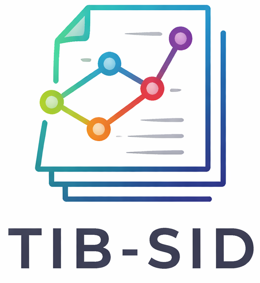

<p align="center">
  
</p>

# 📚 Welcome to the TIB-SID Repository!

**TIB-SID** stands for **TIB Subject Indexing Dataset**.

## 💡 About

The **TIB Subject Indexing Dataset (TIB-SID)** supports the research community 🤝 in developing advanced LLM-based and semantic approaches for automated domain classification and subject indexing 📑 of library records from a national library in Germany. The records are primarily in German and English, though the collection is not limited to these languages.

For subject taxonomy, we rely on the [GND](https://www.dnb.de/EN/Professionell/Standardisierung/GND/gnd_node.html) (**Gemeinsame Normdatei / Integrated Authority File**), an international authority file widely used in German-speaking library systems to catalog and connect information on people, organizations, topics, and works.

## 📂 Repository Contents

To support system development, we release four key components:

- [**28_domains_list.csv**](28_domains_list.csv): A list of 28 domains representing the coarse-grained classification scheme applied to the library records. A single record may be assigned more than one domain.

- [**GND**](./GND): Resources related to the GND, including a human-readable version of the GND subject taxonomy. The taxonomy comprises over 200,000 subject headings and serves as the controlled vocabulary for fine-grained subject indexing of the library’s bibliographic records.

- [**library-records-dataset**](./library-records-dataset): Open-access annotated library records with predefined train/dev/test splits. The dataset contains records in German and English annotated with domain labels and GND subjects. It covers five representative record types: `article`, `book`, `conference`, `report`, and `thesis`.

  Both the GND taxonomy and the open-access records have been reorganized and reformatted with human-readable tags for seamless machine learning use. Since standardized library taxonomies often rely on complex legacy codes ⏳, we consulted subject specialists to preprocess and simplify the data. This allows researchers to focus on developing ML models rather than decoding intricate data formats.

- [**evaluation**](./evaluation): Evaluation scripts providing quantitative metrics—`precision@k`, `recall@k`, `f1@k`, `recall_precision@k`, and `ndcg@k`—for assessing system predictions against the released gold-standard annotations.

<!--
## 📧 Contact

llms4subjects [at] gmail.com

## 💡 Citation

The recommended citation for this dataset resource is provided below. If you find this resource useful, please consider citing it.

```bibtex
@InProceedings{dsouza-EtAl:2025:SemEval2025,
author    = {D'Souza, Jennifer and Sadruddin, Sameer and Israel, Holger and Begoin, Mathias and Slawig, Diana},
title     = {SemEval-2025 Task 5: LLMs4Subjects - LLM-based Automated Subject Tagging for a National Technical Library's Open-Access Catalog},
booktitle = {Proceedings of the 19th International Workshop on Semantic Evaluation (SemEval-2025)},
month     = {August},
year      = {2025},
address   = {Vienna, Austria},
publisher = {Association for Computational Linguistics},
pages     = {1082--1095},
url       = {https://aclanthology.org/2025.semeval2025-1.139}
}
```

```bibtex
@misc{D_Souza_The_GermEval_2025_2025,
author = {D'Souza, Jennifer and Sadruddin, Sameer and Israel, Holger and Begoin, Mathias and Slawig, Diana},
doi = {10.5281/zenodo.16743609},
month = mar,
title = {{The GermEval 2025 2nd LLMs4Subjects Shared Task Dataset}},
url = {https://github.com/sciknoworg/llms4subjects},
year = {2025}
}
```

## ⭐ Acknowledgements

The **LLMs4Subjects** shared task, organized as GermEval 2025, is jointly supported by the [SCINEXT project](https://scinext-project.github.io/) (BMBF, German Federal Ministry of Education and Research, Grant ID: 01lS22070) and the [NFDI4DataScience initiative](https://www.nfdi4datascience.de/) (DFG, German Research Foundation, Grant ID: 460234259).
 -->

This work is licensed under a
[Creative Commons Attribution-ShareAlike 4.0 International License][cc-by-sa].

[![CC BY-SA 4.0][cc-by-sa-image]][cc-by-sa]

[cc-by-sa]: http://creativecommons.org/licenses/by-sa/4.0/
[cc-by-sa-image]: https://licensebuttons.net/l/by-sa/4.0/88x31.png
[cc-by-sa-shield]: https://img.shields.io/badge/License-CC%20BY--SA%204.0-lightgrey.svg